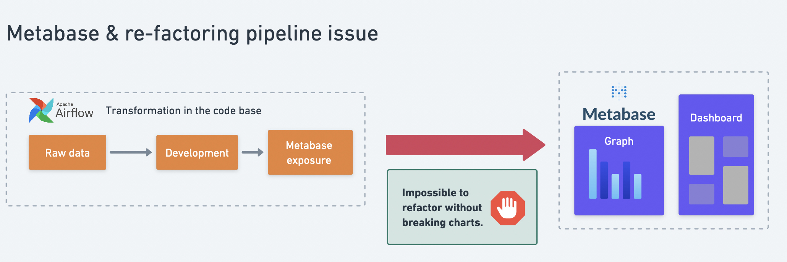
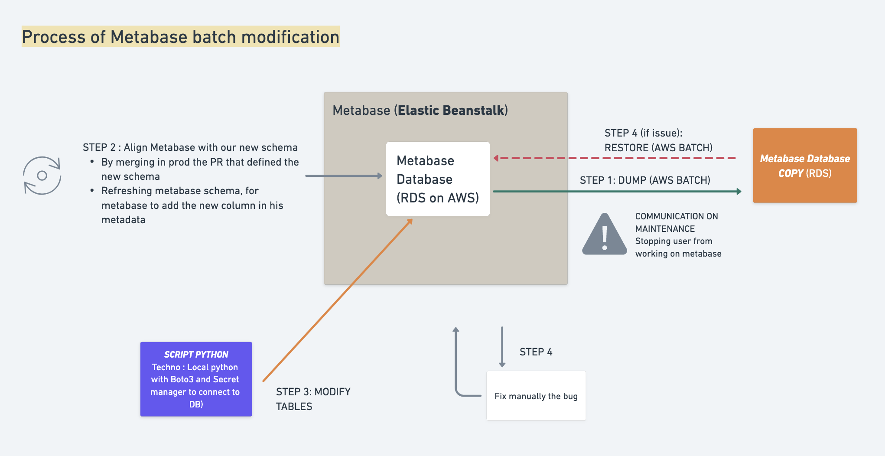

# adapTable 
[](https://www.gnu.org/licenses/gpl-3.0)
[](code_of_conduct.md)
[](https://github.com/psf/black)


"adapTable" is an unofficial open source tool developed in python by Ovrsea in order to help other data teams administrate
more efficiently dashboards, cards and tables in Metabase.
This script has been tested on Metabase version 0.45.3 only for now. 

**WARNING 1: Before triggering this script always check for a way to restore your past 
Metabase environment in case undesirable effect occurs.**
**WARNING 2: This script is not an official Metabase tool. It has for main goal to trigger emulation around Metabase administration. While
being hard to maintain on the long run, it could at least help data team consider global fix for refactoring and help them understand better Metabase
workflow.**

---

# A. Context

## 1. Purpose of this tool 

Metabase usage requires often a lot of manual tasks due to : 
- refactoring of tables breaking graphs
- cleaning of old dashboards and cards unused

The need for an open source project comes from the fact that this problem seems to be 
recurrent and common to many companies as the following discussions on forums show:
- [https://discourse.metabase.com/t/modify-columns-and-table-name-in-all-requests/17858](https://discourse.metabase.com/t/modify-columns-and-table-name-in-all-requests/17858)
- [https://stackoverflow.com/questions/61365148/rename-underlying-table-without-breaking-dashboards-in-metabase](https://stackoverflow.com/questions/61365148/rename-underlying-table-without-breaking-dashboards-in-metabase)
- [https://discourse.metabase.com/t/rename-underlying-table/11790](https://discourse.metabase.com/t/rename-underlying-table/11790)


This is why we have created this package that automate some painful use cases of Metabase administration.
While not being perfect this tool aims at providing a 80/20 solution that would avoid many manual and repetitive tasks. 


## 2. Use cases handled

#### a. Refactoring case
While your pipeline is evolving, you might want to adapt the tables exposed to Metabase to be as user-friendly as possible. 
This is even more true for scale-ups that have reached a level where they want to put in place a concrete 
“Data as a Product” strategy relying on isolated and independent data islands (subsets of entities that are 
connected to each other via relationships, but that are independent of other entities within the same data store)
However, such refactoring is often defied by the impossibilities to propagate easily these changes in the metabase 
metadata to avoid most of the charts to break. 



The choice of the use cases treated by this script comes from the compromise 
between the specific need in terms of refactoring we have and the risk coming along with modifying metadata.

For now you can use this tool to do two types of refactoring on your tables:

- **rename a column**
- **rename an entire table**
- **rename a schema**

We have also considered the case 'deletion of a column'.
However, it seems that no general solution can be found to fix questions that truly depend on this column. 
For more information check our “Metabase Database Analysis” report.

#### b. Cleaning case
In addition to the refactoring case we have also implemented functions that will handle the archiving
of cards and dashboards that have not been used for x months. 


---

# B. Installation 

This project is packaged and hosted in Pypi. 
It requires python ^3.9. 

You can use the package on any project by simply installing it :
```pip install adaptable```
or ```poetry add adaptable```

Note: Don't use version prior to 0.1.7.


---

# C. How to use it

Before triggering the script, we strongly advise you to configure a way to restore your previous Metabase version.
The reason is that this script is touching to Metabase metadata database and 
so could corrupt your data which would result in losing dashboard or graphs. 
While the “rename a column” and “rename a table” use cases have been widely tested, we can’t ensure that no 
side effect will happen. Similarly, after the script ran, you should check that the changes propagated 
are conformed to what you were expecting. 

<ins>Plan of execution </ins>

We are advising you to do the schema refactoring in 4 steps:
- Step 1: Cutting access to our users and taking a snapshot of the database of Metabase.
- Step 2: Push the refacto of your tables in production and then rescanning your db with Metabase.
- Step 3: Triggering Metabase adapTable function through a predefined script where you have planned all the changes you wanted to trigger.
- Step 4: Testing quickly the possible side effects on the graphs and dashboard directly in Metabase and 
deciding whether you want to keep the changes or restore the previous back-up.

This process should take you no more than 1 hour and a half in total. 



You will find examples of script in the folder "use_cases_example"

---

# D. Available functions

AdapTable contains two modules:
- cleaning: that handles the archiving of cards or dashboard on specific use cases.
- refactoring: that enables to fix your metabase to consider changes that you already made in your own database.


### *Cleaning*
The sub_package cleaning contains one module:
- archiving: enabling card and dashboard that have not looked at in the previous months
to be archived automatically.


### *Refactoring*

The sub_package archiving contains two modules:
- reference_system: fixing changes at the level of custom questions using the scan connexion 
between your DB and Metabase ones
- sql_query: fixing changes at the level of sql query. This module is risky to use for now as 
it is hard to predict the behaviour depending on sql standard of code. 

*You will find example of "how to use adapTable" in the folder named "use_cases_example".

--- 

# Other documentations

As an open source project here are the others documents you want to check :
- [CODE_OF_CONDUCT.md](documentation/CODE_OF_CONDUCT.md)
- [LICENSE.md](documentation/LICENSE.md)
- [CONTRIBUTING.md](documentation/CONTRIBUTING.md)

You will also find an entire documentation generated by sphinx in the docs/_build/html folder.


